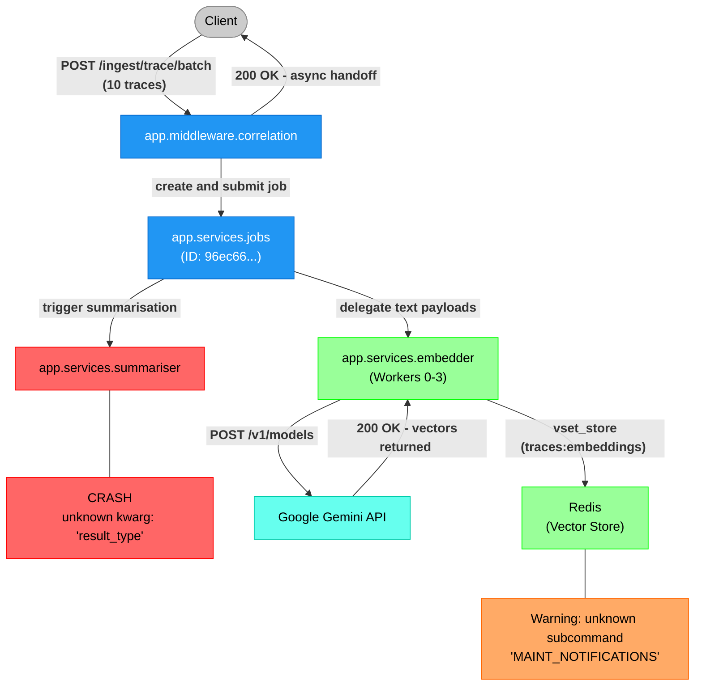

```mermaid
flowchart TD
    Client(["Client"])
    MW["app.middleware.correlation"]
    Jobs["app.services.jobs<br>(ID: 96ec66...)"]
    Summ["app.services.summariser"]
    CrashNote["CRASH<br>unknown kwarg: 'result_type'"]
    Emb["app.services.embedder<br>(Workers 0-3)"]
    Gemini["Google Gemini API"]
    Redis["Redis<br>(Vector Store)"]
    WarnNote["Warning: unknown subcommand<br>'MAINT_NOTIFICATIONS'"]

    Client -->|"<b>&nbsp;POST /ingest/trace/batch (10 traces)&nbsp;</b>"| MW
    MW -->|"<b>&nbsp;create and submit job&nbsp;</b>"| Jobs
    MW -->|"<b>&nbsp;200 OK - async handoff&nbsp;</b>"| Client

    Jobs -->|"<b>&nbsp;trigger summarisation&nbsp;</b>"| Summ
    Summ --- CrashNote

    Jobs -->|"<b>&nbsp;delegate text payloads&nbsp;</b>"| Emb
    Emb -->|"<b>&nbsp;POST /v1/models&nbsp;</b>"| Gemini
    Gemini -->|"<b>&nbsp;200 OK - vectors returned&nbsp;</b>"| Emb
    Emb -->|"<b>&nbsp;vset_store (traces:embeddings)&nbsp;</b>"| Redis
    Redis --- WarnNote

    classDef blue fill:#2196F3,stroke:#0066cc,color:#FFF
    classDef green fill:#99ff99,stroke:#00ff00,color:#000
    classDef red fill:#ff6666,stroke:#ff0000,color:#000
    classDef orange fill:#ffaa66,stroke:#ff6600,color:#000
    classDef yellow fill:#ffff66,stroke:#ffcc00,color:#000
    classDef grey fill:#cccccc,stroke:#888888,color:#000

    class Client grey
    class MW blue
    class Jobs blue
    class Summ red
    class CrashNote red
    class Emb green
    class Gemini teal
    class Redis green
    class WarnNote orange

    classDef teal fill:#66ffee,stroke:#00ccaa,color:#000
```

